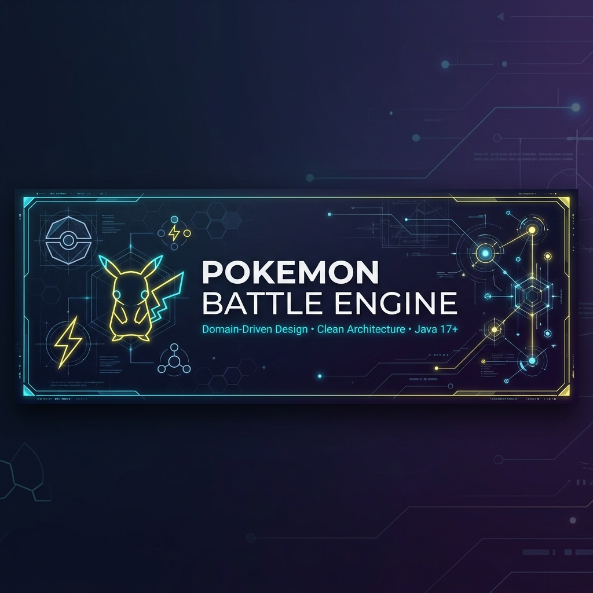

<div align="center">



# ⚔️ Pokémon Battle Engine

**A production-grade Pokémon combat and simulation engine built with professional software architecture principles.**

[](https://openjdk.org/)
[](#-architecture)
[](#-architecture)
[](LICENSE)
[](#-project-status)
[](#)

---

**Domain-Driven Design** · **Clean Architecture** · **Hexagonal Architecture (Ports & Adapters)**

[Getting Started](#-getting-started) · [Architecture](#-architecture) · [Roadmap](#-roadmap) · [Contributing](#-contributing)

</div>

---

## 📖 Overview

This is not just a game — it's a **complete domain model** that faithfully implements the mechanics of Pokémon battles using professional software engineering practices. The engine features a fully decoupled combat system, real progression mechanics (leveling + experience), dynamic stat calculation, domain events, and an extensible damage pipeline.

### ✨ Key Highlights

| Feature | Description |
|---|---|
| 🎯 **Decoupled Battle System** | State-driven combat with pluggable damage modifiers |
| 📈 **Real Progression** | Experience curves, dynamic stat calculation, level-up mechanics |
| 🧩 **Rich Domain Model** | Entities, Value Objects, Aggregates, and Domain Events |
| 🔌 **Ports & Adapters** | Fully swappable infrastructure without touching business logic |
| 🔗 **Extensible Pipeline** | Chain of Responsibility for damage calculation (STAB, Crit, Type, Weather) |
| 📡 **Domain Events** | Event-driven architecture for cross-cutting concerns |

---

## 🧠 Architecture

The project follows a combination of three architectural principles:

```
┌─────────────────────────────────────────────────────────┐
│                      INBOUND ADAPTERS                   │
│                    (UI · Game Engine)                    │
├─────────────────────────────────────────────────────────┤
│                          PORTS                          │
│                   (Interfaces / APIs)                   │
├─────────────────────────────────────────────────────────┤
│                     APPLICATION                         │
│                (Use Cases · Commands)                   │
├─────────────────────────────────────────────────────────┤
│                       DOMAIN                            │
│     (Entities · Value Objects · Services · Events)      │
├─────────────────────────────────────────────────────────┤
│                          PORTS                          │
│              (Repository · Event · Random)              │
├─────────────────────────────────────────────────────────┤
│                    OUTBOUND ADAPTERS                    │
│            (JSON Repos · EventBus · RNG)                │
└─────────────────────────────────────────────────────────┘
```

<details>
<summary><b>🟢 Domain-Driven Design (DDD)</b></summary>

- The domain is the **core** of the system
- Well-defined Entities, Value Objects, and Aggregates
- Business logic is **encapsulated** within the domain layer
- Ubiquitous language used throughout the codebase
</details>

<details>
<summary><b>🔵 Clean Architecture</b></summary>

- Dependencies always point **inward**
- Domain has **zero external dependencies**
- Use Cases orchestrate the system flow
- Framework-independent design
</details>

<details>
<summary><b>🟣 Hexagonal Architecture (Ports & Adapters)</b></summary>

- **Inbound:** UI / Game Engine
- **Outbound:** Persistence, RNG, Events
- All external access goes through **Ports** (interfaces)
- Adapters are **swappable** without domain changes
</details>

### 🏗️ Design Patterns Used

| Pattern | Where | Purpose |
|---|---|---|
| **State** | `battle/state/` | Battle flow control (player turn → enemy turn → resolve → end) |
| **Chain of Responsibility** | `battle/pipeline/` | Modular damage calculation pipeline |
| **Factory** | `factory/` | Pokémon creation with stat calculation |
| **Strategy** | `ExperienceCurve` | Pluggable experience growth formulas |
| **Aggregate Root** | `Trainer`, `Battle` | Protect domain invariants |
| **Value Object** | `vo/` | Immutable domain primitives (Level, HP, Experience, Money) |
| **Domain Events** | `events/` | Decouple side effects from core logic |
| **Command** | `commands/` | Encapsulate use case inputs |

---

## 📂 Project Structure

```
src/
├── domain/                          # 🟢 Core business logic (no external dependencies)
│   ├── model/                       #    Entities & Value Objects
│   │   ├── Pokemon.java             #    Main entity
│   │   ├── Trainer.java             #    Aggregate root
│   │   ├── PokemonSpecies.java      #    Species template (base stats, types, moves)
│   │   ├── Stats.java               #    Composite Value Object
│   │   ├── Move.java                #    Base move model
│   │   ├── Ability.java             #    Pokémon abilities
│   │   ├── Item.java                #    Usable items
│   │   ├── vo/                      #    Primitive Value Objects
│   │   │   ├── Level.java
│   │   │   ├── Experience.java
│   │   │   ├── HP.java
│   │   │   └── Money.java
│   │   ├── moves/                   #    Move specializations
│   │   │   ├── PhysicalMove.java
│   │   │   ├── SpecialMove.java
│   │   │   └── StatusMove.java
│   │   └── inventory/
│   │       └── Inventory.java
│   │
│   ├── battle/                      #    ⚔️ Combat system
│   │   ├── Battle.java              #    Battle aggregate root
│   │   ├── BattleAction.java        #    Player/enemy actions
│   │   ├── BattleContext.java       #    Battle state container
│   │   ├── BattleResult.java        #    Battle outcome
│   │   ├── BattleSystem.java        #    Combat orchestrator
│   │   ├── DamageCalculator.java    #    Core damage formula
│   │   ├── TurnManager.java         #    Turn order resolution
│   │   ├── TypeEffectivenessMatrix.java  # Type chart
│   │   ├── pipeline/                #    🔗 Damage modifier chain
│   │   │   ├── DamageModifier.java
│   │   │   ├── DamagePipeline.java
│   │   │   ├── CriticalModifier.java
│   │   │   ├── StabModifier.java
│   │   │   ├── TypeModifier.java
│   │   │   └── WeatherModifier.java
│   │   └── state/                   #    🧠 Battle state machine
│   │       ├── BattleState.java
│   │       ├── BattleStartState.java
│   │       ├── PlayerTurnState.java
│   │       ├── EnemyTurnState.java
│   │       ├── ResolveTurnState.java
│   │       └── BattleEndedState.java
│   │
│   ├── enums/                       #    Type-safe enumerations
│   │   ├── PokemonType.java
│   │   ├── MoveCategory.java
│   │   ├── StatusEffect.java
│   │   ├── ItemType.java
│   │   └── WeatherType.java
│   │
│   ├── events/                      #    📡 Domain events
│   │   ├── EventListener.java
│   │   ├── BattleStartedEvent.java
│   │   ├── BattleEndedEvent.java
│   │   ├── PokemonFaintedEvent.java
│   │   ├── PokemonCapturedEvent.java
│   │   ├── PokemonLeveledUpEvent.java
│   │   └── ItemUsedEvent.java
│   │
│   ├── factory/
│   │   └── PokemonFactory.java      #    Creates Pokémon with calculated stats
│   │
│   ├── services/                    #    Domain services
│   │   ├── ExperienceService.java
│   │   ├── CaptureService.java
│   │   ├── ExperienceCurve.java
│   │   ├── MediumFastCurve.java
│   │   ├── StatCalculator.java
│   │   └── DefaultStatCalculator.java
│   │
│   └── world/                       #    World model
│       ├── Region.java
│       ├── Location.java
│       ├── Route.java
│       ├── Facility.java
│       └── WildEncounter.java
│
├── application/                     # 🔵 Use cases & orchestration
│   ├── commands/
│   │   ├── CapturePokemonCommand.java
│   │   └── ExecuteTurnCommand.java
│   ├── usecases/
│   │   ├── StartBattleUseCase.java
│   │   ├── ExecuteTurnUseCase.java
│   │   ├── CapturePokemonUseCase.java
│   │   ├── GainExperienceUseCase.java
│   │   └── HealPokemonUseCase.java
│   └── ports/                       #    Interfaces (contracts)
│       ├── PokemonRepositoryPort.java
│       ├── PokemonSpeciesRepositoryPort.java
│       ├── TrainerRepositoryPort.java
│       ├── SaveRepositoryPort.java
│       ├── RandomPort.java
│       └── DomainEventPublisherPort.java
│
├── adapters/                        # 🟣 Infrastructure implementations
│   ├── inbound/
│   │   ├── ui/                      #    Console interface
│   │   │   ├── ConsoleUI.java
│   │   │   ├── BattleUI.java
│   │   │   ├── TrainerUI.java
│   │   │   └── MenuSystem.java
│   │   └── engine/                  #    Game loop
│   │       ├── GameEngine.java
│   │       ├── GameManager.java
│   │       ├── GameConfig.java
│   │       └── GameState.java
│   └── outbound/
│       ├── persistence/             #    Data access
│       │   ├── JsonPokemonSpeciesRepository.java
│       │   ├── PokemonRepositoryImpl.java
│       │   ├── TrainerRepositoryImpl.java
│       │   └── SaveRepositoryImpl.java
│       ├── events/
│       │   └── InMemoryEventBus.java
│       └── random/
│           └── JavaRandomAdapter.java
│
├── infrastructure/                  # 📦 Data & utilities
│   ├── data/
│   │   ├── json/                    #    Game data files
│   │   │   ├── pokemon.json
│   │   │   ├── moves.json
│   │   │   └── items.json
│   │   └── loaders/                 #    Data loaders
│   │       ├── PokemonDataLoader.java
│   │       ├── MoveDataLoader.java
│   │       ├── ItemDataLoader.java
│   │       └── AbilityDataLoader.java
│   ├── registry/
│   │   └── PokemonRegistry.java
│   └── utils/
│       └── Logger.java
│
├── bootstrap/                       # 🚀 Application entry point
│   ├── Main.java
│   └── GameModule.java
│
└── test/                            # 🧪 Test suite
    ├── domain/
    │   ├── model/
    │   │   └── vo/
    │   │       ├── LevelTest.java
    │   │       ├── ExperienceTest.java
    │   │       ├── HPTest.java
    │   │       └── MoneyTest.java
    │   ├── battle/
    │   │   ├── DamageCalculatorTest.java
    │   │   ├── TypeEffectivenessMatrixTest.java
    │   │   └── pipeline/
    │   │       └── DamagePipelineTest.java
    │   ├── services/
    │   │   ├── StatCalculatorTest.java
    │   │   └── ExperienceCurveTest.java
    │   └── factory/
    │       └── PokemonFactoryTest.java
    ├── application/
    │   └── usecases/
    │       ├── StartBattleUseCaseTest.java
    │       ├── ExecuteTurnUseCaseTest.java
    │       └── CapturePokemonUseCaseTest.java
    └── adapters/
        └── outbound/
            └── persistence/
                └── JsonPokemonSpeciesRepositoryTest.java
```

---

## ⚔️ Battle System

The combat engine is the heart of the project, built with two core design patterns:

### 🧠 State Machine (State Pattern)

Controls the battle flow through well-defined states:

```
┌──────────────┐     ┌──────────────┐     ┌──────────────┐     ┌──────────────┐
│ BattleStart  │ ──▸ │ PlayerTurn   │ ──▸ │  EnemyTurn   │ ──▸ │ ResolveTurn  │
└──────────────┘     └──────────────┘     └──────────────┘     └──────┬───────┘
                           ▴                                         │
                           │              ┌──────────────┐           │
                           └───────────── │ BattleEnded  │ ◂─────────┘
                          (if not ended)  └──────────────┘   (if fainted)
```

### 🔗 Damage Pipeline (Chain of Responsibility)

Modular, extensible damage calculation:

```
Raw Damage ──▸ STAB ──▸ Type ──▸ Critical ──▸ Weather ──▸ Final Damage
```

Each modifier is an independent, testable unit that can be added, removed, or reordered without affecting the others.

---

## 📈 Progression System

| Component | Responsibility |
|---|---|
| `ExperienceCurve` | Defines EXP required per level (e.g., `exp = level³`) |
| `StatCalculator` | Computes real stats from base stats + level using game formulas |
| `Level` / `Experience` | Immutable Value Objects enforcing domain rules |

---

## 🚀 Getting Started

### Prerequisites

- **Java 17** or higher ([Download](https://adoptium.net/))
- **Git** ([Download](https://git-scm.com/))

### Installation

```bash
# 1. Clone the repository
git clone https://github.com/Marianagmn/PokemonSimulator.git
cd PokemonSimulator

# 2. Compile
javac -d out src/**/*.java

# 3. Run
java -cp out bootstrap.Main
```

### Quick Example

```java
// Create a Pokémon
Pokemon pikachu = pokemonFactory.create("PIKACHU", Level.of(5));

// Gain experience and level up
pikachu.gainExperience(500);
System.out.println(pikachu);

// Start a battle
Battle battle = startBattleUseCase.execute(player, wildPokemon);
battle.executeTurn(playerMove);
```

---

## 🧪 Testing

### Test Structure

Tests mirror the source structure under `src/test/`:

```
test/
├── domain/            # Unit tests for domain logic
│   ├── model/vo/      # Value Object validation & immutability
│   ├── battle/        # Damage calculation & type effectiveness
│   ├── services/      # Stat calculation & experience curves
│   └── factory/       # Pokémon creation
├── application/       # Use case integration tests
│   └── usecases/      # Battle, capture, experience flows
└── adapters/          # Adapter tests
    └── outbound/      # Repository implementations
```

### What to Test (Priority Order)

| Priority | Layer | What to Test | Example |
|---|---|---|---|
| 🔴 High | Value Objects | Validation, immutability, equality | `Level.of(-1)` throws exception |
| 🔴 High | Domain Services | Business rules, calculations | `StatCalculator` produces correct stats |
| 🟠 Medium | Battle Pipeline | Each modifier individually | `StabModifier` applies 1.5x correctly |
| 🟠 Medium | Use Cases | Orchestration flow | `StartBattleUseCase` initializes correctly |
| 🟡 Low | Adapters | Data loading, serialization | JSON repository loads Pokémon data |

### Running Tests

```bash
# Run all tests (with JUnit 5)
java -jar junit-platform-console-standalone.jar --scan-classpath --class-path out:out-test

# Or with Maven/Gradle (if configured)
mvn test
# or
gradle test
```

---

## 🗺️ Roadmap

> Development phases following Domain-Driven Design methodology — building from the inside out.

### Phase 1 — Domain Foundation `COMPLETE`
- [x] Value Objects: `Level`, `Experience`, `HP`, `Money`
- [x] Enums: `PokemonType`, `MoveCategory`, `StatusEffect`, `WeatherType`
- [x] Composite Value Object: `Stats`

### Phase 2 — Base Models `COMPLETE`
- [x] `Move`, `Ability`, `Item`

### Phase 3 — Progression System `COMPLETE`
- [x] `ExperienceCurve` + `MediumFastCurve`
- [x] `StatCalculator` + `DefaultStatCalculator`

### Phase 4 — Species & Entity `COMPLETE`
- [x] `PokemonSpecies` (base stats, types, moves, abilities, exp curve)
- [x] `Pokemon` entity (HP, Level, Experience, Stats, damage/heal/levelUp logic)

### Phase 5 — Aggregates & Factory `COMPLETE`
- [x] `Trainer` + `Inventory` (Aggregate Root)
- [x] `PokemonFactory`

### Phase 6 — Domain Services `COMPLETE`
- [x] `ExperienceService`, `CaptureService`

### Phase 7 — Battle System `COMPLETE`
- [x] `BattleAction`, `BattleContext`, `DamageCalculator`
- [x] `TypeEffectivenessMatrix`, `TurnManager`, `BattleSystem`
- [x] Damage Pipeline (STAB, Crit, Type, Weather modifiers)
- [x] State Machine (Start → PlayerTurn → EnemyTurn → Resolve → End)
- [x] `Battle` Aggregate

### Phase 8 — Domain Events `COMPLETE`
- [x] `PokemonFaintedEvent`, `PokemonCapturedEvent`, `PokemonLeveledUpEvent`
- [x] `BattleStartedEvent`, `BattleEndedEvent`, `ItemUsedEvent`

### Phase 9 — Application Layer `COMPLETE`
- [x] Commands: `CapturePokemonCommand`, `ExecuteTurnCommand`
- [x] Use Cases: Start Battle, Execute Turn, Capture, Gain EXP, Heal

### Phase 10 — Ports & Adapters `COMPLETE`
- [x] Repository Ports + JSON implementations
- [x] `RandomPort` + `JavaRandomAdapter`
- [x] `DomainEventPublisherPort` + `InMemoryEventBus`

### Phase 11 — UI & Engine `COMPLETE`
- [x] Console UI (Battle, Trainer, Menu)
- [x] `GameEngine`, `GameManager`, `GameConfig`, `GameState`

### Phase 12 — Bootstrap `COMPLETE`
- [x] `GameModule` (dependency wiring)
- [x] `Main` entry point

### 🔮 Future Enhancements
- [ ] Full test suite with JUnit 5
- [ ] Real database persistence (SQLite / H2)
- [ ] Advanced UI (JavaFX or web-based)
- [ ] Multiplayer battle support
- [ ] AI opponent with difficulty levels
- [ ] Save/Load game state
- [ ] Extended Pokédex with Gen I–III data
- [ ] Game balance and playtesting

---

## 💡 Key Principles

| Principle | Application |
|---|---|
| **Immutability** | All Value Objects are immutable |
| **Aggregate Invariants** | Aggregates protect their internal consistency |
| **No Logic in Infrastructure** | Infrastructure only handles I/O and data mapping |
| **Dependency Inversion** | Domain defines Ports; Adapters implement them |
| **Ubiquitous Language** | Code reads like the domain (Pokémon terminology) |
| **Single Responsibility** | Each class has one reason to change |

---

## 🛠️ Tech Stack

| Technology | Purpose |
|---|---|
| **Java 17+** | Core language with modern features (records, sealed classes, pattern matching) |
| **JSON** | Data-driven design for Pokémon, moves, and items |
| **JUnit 5** | Unit and integration testing |
| **No framework required** | Clean architecture — framework independent |

---

## 🤝 Contributing

Contributions are welcome! If you'd like to contribute:

1. Fork the repository
2. Create a feature branch (`git checkout -b feature/amazing-feature`)
3. Commit your changes (`git commit -m 'Add amazing feature'`)
4. Push to the branch (`git push origin feature/amazing-feature`)
5. Open a Pull Request

---

## 👩‍💻 Author

**Marianagmn**

> Project focused on **advanced software architecture** applied to game development.  
> Built as a professional portfolio piece demonstrating DDD, Clean Architecture, and Hexagonal Architecture in Java.

[](https://github.com/Marianagmn)

---

## ⚠️ Disclaimer

> **Pokémon** is a registered trademark of **Nintendo**, **Game Freak**, and **The Pokémon Company**.  
> This project is **NOT** affiliated with, endorsed by, or connected to Nintendo, Game Freak, The Pokémon Company, or any of their subsidiaries or affiliates in any way.
>
> All Pokémon names, characters, and related content are the intellectual property of their respective owners.  
> This project uses Pokémon concepts **solely as a learning exercise** for software architecture and design patterns.  
> **No copyright infringement is intended.**

---

## 📄 License

This project is for **educational and personal learning purposes only**.  
It is **NOT** intended for commercial use, distribution, or profit of any kind.

See the [LICENSE](LICENSE) file for full details.

---

<div align="center">

**⭐ Star this repo if you find it useful!**

*Built with ❤️ and clean code — for learning purposes only*

</div>